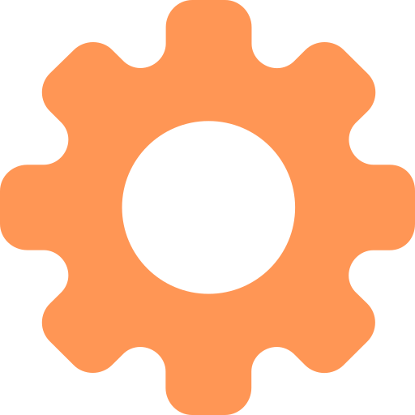

<div align="center">

<h1>sfml</h1>
<p>A simple factorio modding language.</p>
<b>sfml → lua transpiler</b>
</div>

# Getting started

Before you start with sfml, it's recommended that you learn the basics of modding.
The Factorio wiki has great [resources](https://wiki.factorio.com/Tutorial:Modding_tutorial/Gangsir) for this.

## 1. Clone the example project.

Using git, clone the repository.

```bash
git clone https://github.com/languint/sfml-example
```

## 2. Configuration

Next, you should see a file named `project.toml`.